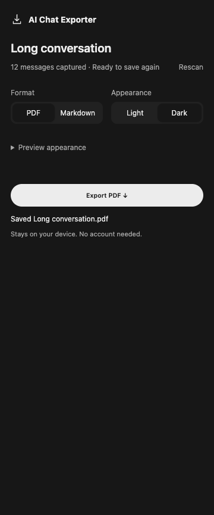

# AI Chat Exporter

Keep AI conversations as readable PDF or Markdown files. One familiar ChatGPT-style layout, in light or dark. Everything runs on your device.



[Dark transcript sample](docs/images/transcript-dark.png) · [Light transcript sample](docs/images/transcript-light.png). Demo content is synthetic.

**v0.4.2 beta.** Export controls stay beside your chat in Chrome's side panel. Capture and recovery are tested against synthetic browser fixtures, including newer ChatGPT message markers and delayed loading. See [verification](docs/VERIFICATION.md) for the separate live ChatGPT check and remaining provider qualification.

## What it does

- Right-aligned user bubbles, plain assistant answers, bold headings, readable tables and code.
- ChatGPT visual components retain their rendered cards, icons, colors, and button labels as static PDF images.
- PDF or Markdown, with only Light/Dark appearance controls.
- One panel alongside the current chat, with an optional appearance preview. Export does not open or navigate a browser tab.
- Full-chat scanning with progress, cancellation, ordered capture, and scroll restoration.
- Fast path for fully mounted conversations; overlapping scan for virtualized history.
- Recognizes legacy and newer ChatGPT role markers, preserves prompt bubbles rendered as buttons, and retries briefly while visible messages load.
- Saved captures can be exported again without rescanning, including Markdown fallback after PDF failure.
- Success appears only after Chrome confirms download completion.
- Local PDF generation, bundled fonts, no analytics, subscriptions, export account, or backend.

ChatGPT and Gemini are the primary capture fixtures. Claude, DeepSeek, Copilot, Perplexity, and Grok retain compatibility selectors; their current live layouts are not newly verified.

## Install

Requires Node.js 22+ and Chrome or Chromium 116+ with the Side Panel API.

```sh
npm ci
npm test
```

1. Open `chrome://extensions` and enable **Developer mode**.
2. Click **Load unpacked**, then choose this project's `dist` folder.
3. Open a supported chat and click the extension to open its side panel.

After source changes, run `npm run build`, then reload the extension.

## Use

Choose **PDF** or **Markdown** in the side panel. For PDF, choose **Light** or **Dark**. Click **Export**: the panel scans the conversation, then asks where to save. Your chat remains on the same tab.

Keep the source chat and side panel open while scanning. **Cancel** stops scanning or PDF rendering. After capture, retry saving or change format without rescanning. **Rescan** discards the captured copy and reads newer messages. Closing or reloading the panel clears its in-memory capture.

Expand **Preview appearance** to see the first page from currently visible messages. Export runs the full scan. Preview content is bounded and does not represent the entire conversation.

## Scope and limits

Scanning checks both loaded scroll boundaries and message continuity. It cannot prove hidden branches, attachments, collapsed artifacts, or history that the site never mounts. Detected gaps fail explicitly instead of saving a known partial transcript.

PDF preserves readable text, lists, tables, code, and links. ChatGPT's rendered visual components are captured as static images, including their layout, icons, colors, and button labels. Tall components continue across pages at readable scale. Their captured state remains fixed; buttons and animations are not interactive in PDF. Markdown retains their text. Ordinary images become descriptions; images inside visual components that the browser cannot read show an explicit unavailable placeholder. Math stays as TeX source. The panel uses the native system font, including Apple's system font on macOS. PDFs bundle Inter for a similar appearance, with Courier for code; conversations containing unsupported characters use a smaller static Regular instance of bundled Noto Sans SC instead. Fonts remain fully embedded to preserve visible glyphs. This layout follows ChatGPT's visual structure; pagination and fonts differ from the original web page.

Capture limits: 10 minutes and 10,000 messages. PDF also applies content limits, a 64 MB output cap, and a 3-minute rendering deadline. Markdown can recover an oversized captured conversation.

## Permissions and privacy

Only `activeTab`, `scripting`, `downloads`, and `sidePanel`. The side-panel permission keeps controls in the same window; no permanent host permissions. Chats stay in browser memory; nothing is sent to a project server. Appearance choice is stored locally. Details: [privacy](PRIVACY.md).

## Development

```sh
npm run check   # TypeScript
npm run build   # dist/
npm test        # unit and integration regressions
```

Real-browser scripts: `tests/capture-browser.mjs`, `tests/capture-scroll-browser.mjs`, `tests/capture-speed-browser.mjs`, `tests/rich-components-browser.mjs`, `tests/chatgpt-compat-browser.mjs`, `tests/extension-browser.mjs`, and `tests/side-panel-browser.mjs`. These additionally require Playwright and compatible Chromium. The rich-component suite also uses PDF.js's optional `@napi-rs/canvas` dependency, installed by a normal `npm ci`. Set `PLAYWRIGHT_MODULE` and `PLAYWRIGHT_EXECUTABLE` when using an existing installation. Extension integration uses isolated temporary profiles, synthetic conversations, and test-only host grants. See [verification](docs/VERIFICATION.md) for coverage and live-provider limits.

```text
src/adapters/    Serialized capture engine and provider compatibility
src/core/        Conversation model, export session, download confirmation
src/popup/       Simple format, appearance, preview, and progress UI
src/renderers/   Markdown and PDF generation, cancellable PDF worker
src/shared/     Appearance and messaging contracts
static/         Manifest, UI, bundled Unicode font
scripts/        Build and dependency-license packaging
tests/          Synthetic regression fixtures
```

Test coverage and known limitations: [verification](docs/VERIFICATION.md).

## License

Original code currently uses [PolyForm Noncommercial 1.0.0](LICENSE.md). It is publicly available for permitted noncommercial use, **source-available rather than OSI open source**. Dependencies keep their own licenses; full applicable texts ship in `dist/licenses` alongside [third-party notices](THIRD_PARTY_NOTICES.md).

This independent project is not endorsed by ChatGPT or other supported providers. Product names belong to their respective owners. Report security issues privately; never include private chats in public issues.
